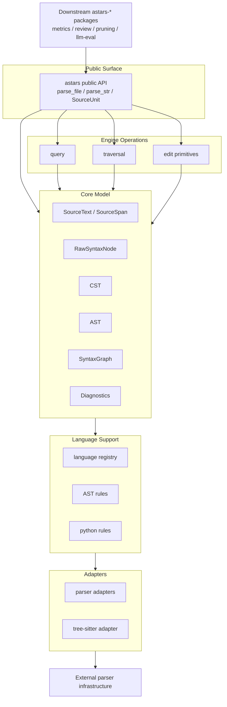
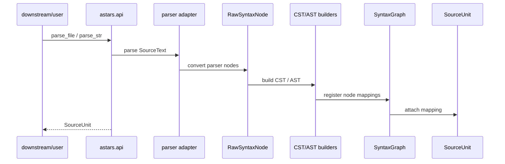
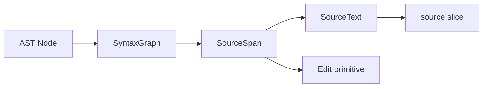

# Astars アーキテクチャ

ステータス: 目標アーキテクチャ draft

関連文書:

- [STRATEGY.ja.md](STRATEGY.ja.md)
- [API_STRATEGY.ja.md](API_STRATEGY.ja.md)
- [CONCEPTS.ja.md](CONCEPTS.ja.md)
- [ROADMAP.ja.md](ROADMAP.ja.md)

この文書は、Astars の概念モデルを実装上の module boundary に落とすための叩き台である。現行コードをそのまま正当化する文書ではなく、`astars-engine` として安定させるべき目標アーキテクチャを示す。

## Architecture Goals

Astars の architecture は、次の性質を満たすことを目指す。

- parser-specific API を core から隔離する
- source mapping を core value として扱う
- analysis-specific な判断を core に入れない
- downstream package が依存しやすい小さな public API を持つ
- Python reference path を安定させつつ、他言語追加の余地を残す
- source-aware edit primitive を提供できる構造にする

## Layer Overview

Astars は、概念的に次の layer に分ける。



依存方向は、downstream package から Astars public API に向かい、Astars 内部では public API から engine operations / core model / language support / adapter へ向かう。adapter は外部 parser に依存してよいが、core model は parser object に依存しない。

## Dependency Direction

原則:

- downstream package は `astars` public API に依存する
- public API は core model と engine operations を組み合わせる
- engine operations は core model に依存する
- language support は adapter と core model の橋渡しをする
- adapter は parser-specific API に依存してよい
- core model は adapter や parser-specific object に依存しない
- core は downstream package に依存しない

依存方向を逆流させないことが、Astars を軽量 engine として保つための重要な制約である。

## Proposed Package Layout

移行後の package layout は、次のような形を目指す。

```text
astars/
  __init__.py

  api/
    __init__.py
    parse.py
    source_unit.py

  core/
    source/
      text.py
      span.py
    syntax/
      raw.py
    cst/
      node.py
      tree.py
      builder.py
    ast/
      node.py
      tree.py
      builder.py
    mapping/
      syntax_graph.py
    diagnostics/
      diagnostic.py

  operations/
    query/
      find.py
      position.py
    traversal/
      walk.py
    edit/
      plan.py
      primitives.py

  languages/
    registry.py
    python/
      adapter.py
      rules/

  adapters/
    parse/
      base.py
      tree_sitter.py

  internal/
    ids.py
    cache.py
```

この layout は提案であり、最終決定ではない。重要なのは、責務の境界と依存方向である。

## Module Responsibilities

### `astars.api`

public API の入口を提供する。

責務:

- `parse_file`, `parse_str`, `parse_bytes` を公開する
- `SourceUnit` を返す
- downstream package が通常触る API を集約する
- internal module の詳細を隠す

`astars.__init__` は、`astars.api` の安定した API だけを再 export する。

### `astars.core.source`

`SourceText` と `SourceSpan` を扱う。

責務:

- source bytes/text を保持する
- byte offset を canonical な位置表現として扱う
- line/column 変換を提供する
- source slice を取得する

### `astars.core.syntax`

parser 由来の構文情報を Astars-owned structure に変換した `RawSyntaxNode` を扱う。

責務:

- parser node の type / field / child relation / source range を保持する
- CST / AST builder の入力になる
- parser-specific object を core model に持ち込まない

### `astars.core.cst`

source-faithful な concrete syntax structure を扱う。

責務:

- source に近い構文構造を保持する
- debugging や low-level transform の基盤になる
- AST では失われる可能性がある構文情報を補う

CST を stable public API にするかは未決定である。

### `astars.core.ast`

analysis-friendly な AST-like structure を扱う。

責務:

- downstream package が query / traversal しやすい node interface を提供する
- function、class、statement、expression などの分析単位を表す
- `SyntaxGraph` を通じて source に戻れる node を提供する

### `astars.core.mapping`

`SyntaxGraph` を扱う。

責務:

- AST node と raw syntax / source span の対応を保持する
- source offset から node を解決する
- node から source slice を取得できるようにする
- edit primitive の対象範囲を決める

### `astars.core.diagnostics`

parse や normalization の診断情報を扱う。

責務:

- syntax error
- unsupported syntax
- mapping failure
- adapter limitation

実行不能なエラーと、parse result に保持できる diagnostics を分ける。

### `astars.operations`

engine-level の generic operation を扱う。

責務:

- AST traversal
- node query
- source position lookup
- source extraction
- generic edit primitive

ここには metrics definition、review policy、pruning strategy のような domain-specific logic を入れない。

### `astars.languages`

言語固有の rule と registry を扱う。

責務:

- language id と adapter/rule set の対応を管理する
- Python reference implementation を置く
- AST rule contract を提供する

`languages/python` は reference path として安定させる。

### `astars.adapters`

外部 parser や外部技術との接続を扱う。

責務:

- tree-sitter parser の呼び出し
- parser-specific node から `RawSyntaxNode` への変換
- parser dependency の不足や unsupported language を検出する

adapter は parser-specific API に依存してよい。ただし、その依存を core model や public API に漏らさない。

### `astars.internal`

外部に安定 API として公開しない補助実装を置く。

例:

- id generation
- cache
- internal helper
- compatibility shim の補助

downstream package は `astars.internal` に依存してはいけない。

## Data Flow

parse の data flow は次の通り。



重要なのは、user が parser object を受け取らないことである。user は `SourceUnit` を通じて AST、query、source mapping、diagnostics にアクセスする。

## Source Mapping Flow

node から source に戻る流れは次の通り。



この flow により、downstream package は分析結果を source span に戻し、review comment、metric location、edit plan などに利用できる。

## Public / Extension / Internal Boundary

### Public

downstream package が通常依存してよいもの:

- `astars.parse_file`
- `astars.parse_str`
- `astars.parse_bytes`
- `SourceUnit`
- AST node interface
- `SourceSpan`
- query / traversal helpers
- generic edit primitive

### Extension-Level

言語追加や advanced customization のために文書化するもの:

- language registry
- AST rule contract
- adapter contract
- `RawSyntaxNode`

### Internal

安定 API として扱わないもの:

- tree-sitter parser object
- tree-sitter node object
- private cache
- internal id generator
- builder の詳細実装
- implementation-specific tree library

## Current Repository Gap

現行 repository には、目標アーキテクチャとずれている箇所がある。

例:

- `astars/__init__.py` が public API として未整理
- `api.py` / `engine.py` の責務が未定義
- `usecase/` が engine operation なのか domain use case なのか曖昧
- `adapter/edit/` が parser adapter なのか edit primitive なのか曖昧
- `core/syntax`, `core/cst`, `core/ast` は方向性が近いが、public boundary は未整理
- examples と README は v0 public API へ移行する

実装整理では、まず public API と core model の境界を固定し、その後に module 名を整理する。

## Migration Notes

移行時の大まかな方針:

1. `astars.api` と `SourceUnit` public handle を作る
2. `parse_file`, `parse_str`, `parse_bytes` を public API として安定させる
3. `RawSyntaxNode`, AST builder, `SyntaxGraph` の責務を `CONCEPTS.ja.md` に合わせる
4. traversal / query / edit primitive を `operations/` に集約する
5. domain-specific な pruning strategy は core から外す
6. legacy `AParser` などを残す場合は thin compatibility shim とする

詳細な移行手順は、別途 `MIGRATION.ja.md` で定義する。

## Open Questions

- `api/` package を作るか、top-level `astars/__init__.py` に集約するか
- `core/mapping/` を独立 package にするか、`core/syntax/` に含めるか
- `languages/` と `adapters/` の境界をどう分けるか
- `operations/edit/` と source text editing backend の責務をどう分けるか
- CST を public API にするか、debug/extension-level に留めるか
- `usecase/` を廃止して `operations/` に置き換えるか
- `internal/` package を明示的に作るか
