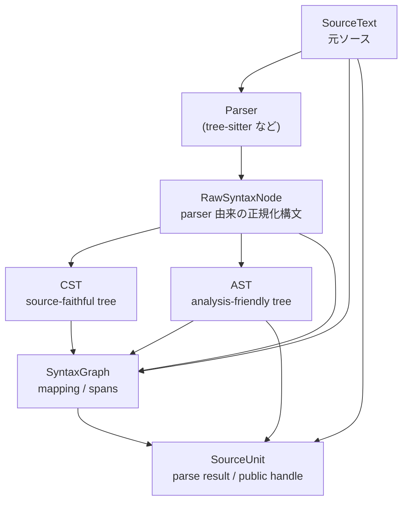

# Astars 概念モデル

ステータス: draft

関連文書:

- [STRATEGY.ja.md](STRATEGY.ja.md)
- [API_STRATEGY.ja.md](API_STRATEGY.ja.md)
- [USE_CASES.ja.md](USE_CASES.ja.md)

この文書は、Astars の中核概念を定義する。目的は、実装名や module 構成に入る前に、Astars が扱う構造、source mapping、編集可能性の意味を揃えることである。

## 基本方針

Astars は、parser 固有の構文木をそのまま downstream package に渡すのではなく、分析しやすく、source に戻れる Astars-owned structure に変換する。

そのために、次の概念を分けて扱う。

- `SourceText`: 元 source code
- `SourceSpan`: source code 上の範囲
- `RawSyntaxNode`: parser 由来の構文情報を正規化した node
- `CST`: source-faithful な具体構文構造
- `AST`: analysis-friendly な抽象構造
- `SyntaxGraph`: source / raw syntax / CST / AST の対応関係
- `SourceUnit`: 1つの source input を parse した結果全体

Astars の価値は、これらをばらばらに持つことではなく、分析しやすい構造と元 source への対応を同時に保つことにある。

## 全体像

概念的な data flow は次の通り。



downstream package は、通常 `SourceUnit`、`AST`、`SourceSpan`、query/traversal API を使う。`RawSyntaxNode` や parser object は、通常 workflow では直接触らない。

## SourceText

`SourceText` は、Astars が parse する元 source code を表す。

責務:

- source bytes/text を保持する
- encoding の扱いを明確にする
- byte offset と line/column の変換を支える
- source slice の取得を支える

`SourceText` は単なる文字列ではない。Astars においては、node と source span を結びつける基準点である。

### 設計メモ

Astars では、byte offset を canonical representation とする。line/column は人間向け表示や diagnostics に必要だが、encoding の影響を受けるため、内部の mapping では byte range を基準にする。

## SourceSpan

`SourceSpan` は、source code 上の範囲を表す。

最低限持つべき情報:

- `start_byte`
- `end_byte`

必要に応じて持つ情報:

- `start_point`
- `end_point`
- `encoding`
- `source_id`

`SourceSpan` は、AST node、CST node、diagnostic、edit primitive、review comment などを source に戻すための共通表現である。

### 境界

`SourceSpan` は「何を意味する範囲か」は判断しない。たとえば、その範囲が危険な API 呼び出しか、metric の対象か、review comment の対象かは downstream package が判断する。

## RawSyntaxNode

`RawSyntaxNode` は、parser 由来の構文情報を Astars 内部で扱いやすく正規化した node である。

責務:

- parser node の type / grammar name / field name / child relation を保持する
- source byte range を保持する
- parser 固有 object への直接依存を減らす
- CST や AST を構築するための入力になる

`RawSyntaxNode` は、tree-sitter node そのものではない。parser-specific object を Astars-owned data structure に写した中間表現である。

### Public API としての位置づけ

`RawSyntaxNode` は、初期方針では stable public API ではなく extension-level または internal に近い概念とする。

downstream analysis package が通常依存すべきなのは、`RawSyntaxNode` ではなく AST-like node interface と source mapping API である。

## CST

`CST` は Concrete Syntax Tree を表す。

Astars における CST は、source-faithful な構文構造であり、parser 由来の具体的な構文要素を保持する。

責務:

- source に近い構文構造を保持する
- token、punctuation、構文上の詳細に近い情報を扱う
- source-aware edit や debugging の基盤になる
- AST だけでは失われる可能性がある構文情報を補う

### AST との違い

CST は source に忠実であることを重視する。AST は分析しやすいことを重視する。

たとえば、括弧、区切り文字、構文上の wrapper node などは CST では重要だが、AST では省略または統合されることがある。

### Public API としての位置づけ

CST を stable public API に含めるかは未決定である。

初期段階では、CST は debugging、extension、source-faithful transform のための低レベル構造として扱い、通常の downstream package は AST と `SyntaxGraph` 経由の source mapping を使う方針が自然である。

## AST

`AST` は、分析しやすい抽象構文構造を表す。

Astars における AST は、言語固有 parser の生 node ではなく、Astars が downstream analysis のために構築する AST-like structure である。

責務:

- downstream analysis package が扱いやすい node kind を提供する
- function、class、statement、expression などの分析単位を表す
- traversal / query の主対象になる
- `SyntaxGraph` を通じて source span に戻れる

### Node Interface

AST node は、小さく安定した interface を持つべきである。

想定する属性:

- `kind`
- `id` または `stable_id`
- `role`
- `value`
- `children`

内部実装として `anytree` などを使う可能性はあるが、downstream package にその実装詳細への依存を強制しない。

### 言語非依存性

Astars の AST は完全な language-neutral IR ではない。

初期方針としては、Python を reference language としつつ、他言語へ拡張できる程度に node kind や role の設計を整理する。すべての言語差を消すのではなく、downstream package が共通 workflow を使えるようにすることを優先する。

## SyntaxGraph

`SyntaxGraph` は、source、raw syntax、CST、AST の対応関係を保持する mapping structure である。

責務:

- AST node から raw syntax / source span を引けるようにする
- source offset から node を解決できるようにする
- node に対応する source slice を取得できるようにする
- edit primitive の対象範囲を決める基盤になる

`SyntaxGraph` は Astars の source-faithful 性を支える中核概念である。

### 例

downstream package は、次のような問いを `SyntaxGraph` または `SourceUnit` 経由で解けるべきである。

- この `FunctionDef` node は source のどの範囲に対応するか
- この byte offset に最も近い AST node は何か
- この source span と重なる node はどれか
- この node を削除する場合、どの source range を edit すべきか

## SourceUnit

`SourceUnit` は、1つの source input を parse した結果全体を表す public handle である。

つまり、source、AST、mapping、diagnostics、query helper をまとめた単位である。v0 public API では、この名前を採用する。

責務:

- source を保持する
- root node を提供する
- diagnostics を提供する
- traversal / query API を提供する
- node-to-source / source-to-node mapping API を提供する
- edit primitive の入口になる

想定 API:

```python
unit = astars.parse_file("example.py", lang="python")

root = unit.root
functions = unit.find(kind="FunctionDef")
span = unit.span_of(functions[0])
source = unit.source_of(functions[0])
```

`SourceUnit` の具体的な method set は `API_STRATEGY.ja.md` で定義する。

## Diagnostics

`Diagnostics` は、parse や normalization の過程で発生した問題を表す。

例:

- syntax error
- unsupported syntax
- parser warning
- mapping failure
- language adapter limitation

Astars は、可能であれば syntax error を即 exception にするのではなく、diagnostics として保持した `SourceUnit` を返す方針を検討する。

ただし、unsupported language、parser dependency missing、invalid input のような実行不能な問題は exception として扱ってよい。

## Edit Primitive

`Edit Primitive` は、source-aware な最小編集操作を表す。

例:

- node に対応する source span を削除する
- node に対応する source span を置換する
- node に対応する source を抽出する
- 複数 node selection から edit plan を作る

Astars core は、generic edit primitive を提供してよい。しかし、どの node を選ぶか、なぜその編集を行うかは downstream package が判断する。

## Concept Boundaries

Astars の概念境界は次のように整理する。

### Public Concept

downstream package が通常触ってよい概念:

- `SourceUnit`
- `AST`
- AST node interface
- `SourceSpan`
- diagnostics
- query / traversal / edit primitive

### Extension-Level Concept

言語追加や rule 実装で触る概念:

- `RawSyntaxNode`
- AST rule
- language adapter
- normalization hook

### Internal Concept

通常の downstream package が依存しない概念:

- parser object
- parser-specific node
- internal cache
- private mapping index
- implementation-specific tree library

## Open Questions

- CST を stable public API に含めるか
- `RawSyntaxNode` を extension-level としてどこまで文書化するか
- AST node kind をどこまで language-neutral にするか
- `stable_id` の保証範囲をどう定義するか
- source span の Unicode column 表示をどう扱うか
- edit primitive は text を返すか、edit plan を返すか、新しい `SourceUnit` を返すか
