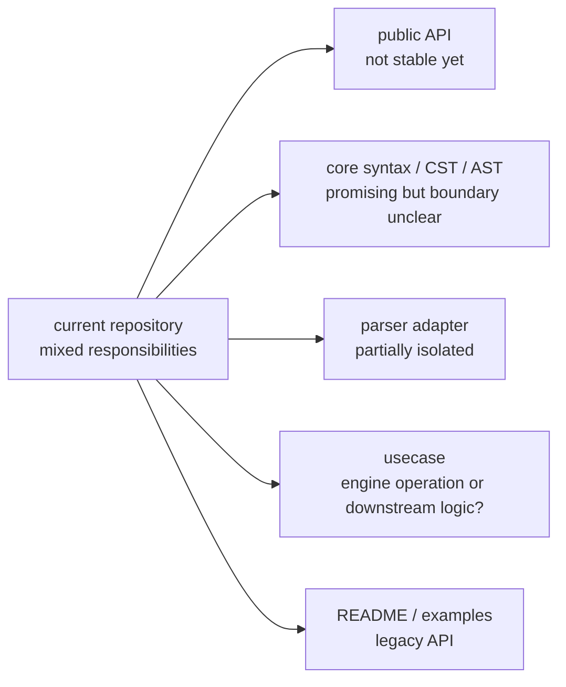
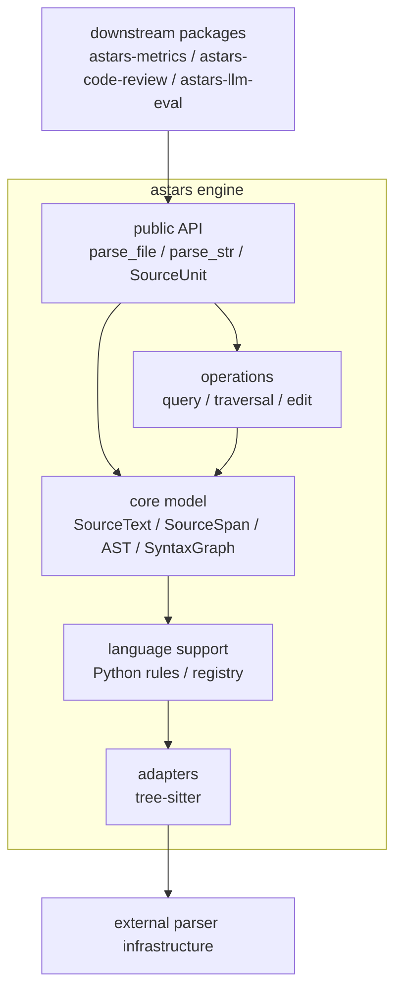
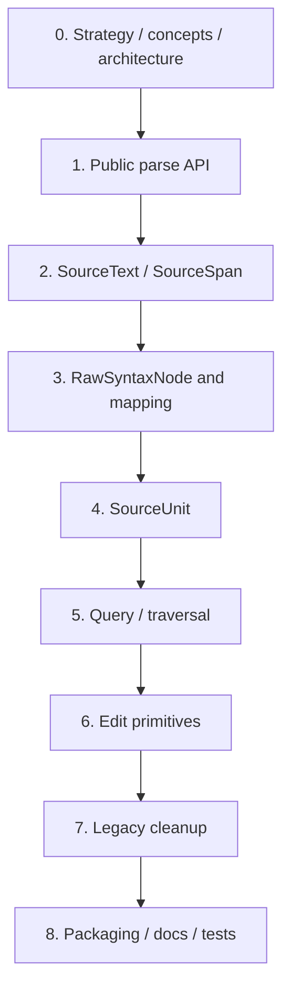

# Astars 移行計画

ステータス: draft

関連文書:

- [STRATEGY.ja.md](STRATEGY.ja.md)
- [CONCEPTS.ja.md](CONCEPTS.ja.md)
- [ARCHITECTURE.ja.md](ARCHITECTURE.ja.md)
- [API_STRATEGY.ja.md](API_STRATEGY.ja.md)
- [ROADMAP.ja.md](ROADMAP.ja.md)

この文書は、現在の Astars repository を、軽量な program structure engine としての Astars に移行するための叩き台である。

目的は、既存実装を一気に捨てることではなく、すでにある parser adapter、core syntax、CST/AST builder、source mapping の芽を、明確な module boundary と public API に整理することである。

## Migration Goal

移行後の Astars は、次の状態を目指す。

1. `astars` を engine package として使える
2. downstream package は `astars.parse_file` / `astars.parse_str` から始められる
3. parser-specific object を通常の user-facing API に露出しない
4. AST-like structure と source span の対応を engine の中核機能として扱う
5. traversal、query、source extraction、generic edit primitive を engine operation として提供する
6. metrics、code review、LLM evaluation、pruning policy などは downstream package に分離できる

現時点では、`astars` という名前を engine の中核 package として使い、`astars-metrics`、`astars-code-review`、`astars-llm-eval` のような package が周辺に広がる前提とする。

## Migration Principles

移行では、次の原則を優先する。

- big-bang rewrite にしない
- public API を先に小さく固定する
- source mapping を後付け機能にしない
- tree-sitter などの parser 依存を adapter に閉じ込める
- domain-specific logic を engine core に入れない
- 既存名を残す場合は thin compatibility shim として扱う
- module rename は、責務の整理が見えた後に行う
- examples と README は、古い API の正当化ではなく、新しい API の利用例として更新する

重要なのは、ディレクトリ名を先に完璧に揃えることではない。まず `SourceUnit`、AST node、`SourceSpan`、`SyntaxGraph` の関係を安定させ、それを public API として使える形にする。

## Current State

現在の repository には、目標アーキテクチャに近い部品と、まだ責務が曖昧な部品が混在している。



主な gap は次の通り。

- `astars.__init__` が安定 public API として整理されていない
- `astars/api.py` と `astars/engine.py` の責務が未定義
- `usecase/` が engine operation と domain-specific use case のどちらを表すのか曖昧
- `adapter/edit/` が adapter なのか edit operation なのか曖昧
- `core/syntax`, `core/cst`, `core/ast` は方向性が近いが、public boundary が未整理
- README と examples が `AParser`, `APruner` などの legacy API を前提としている
- package metadata に runtime dependency と supported language の方針が十分に反映されていない
- tests が新しい engine surface を守る形になっていない

## Target Shape

移行後の概念的な依存方向は次の通り。



この形では、downstream package は Astars の public API に依存する。Astars core は parser object や downstream policy に依存しない。

## Migration Phases

### Phase 0: 移行前提を固定する

最初に、移行中にぶれやすい前提を文書化する。

決めること:

- package/import 名は当面 `astars` を維持する
- `astars` は engine package として扱う
- `astars-*` は engine を使う downstream package として扱う
- source mapping は engine の中核価値として扱う
- pruning は engine operation ではなく downstream policy の候補として扱う

成果物:

- `STRATEGY.ja.md` の方針確認
- `CONCEPTS.ja.md` の概念名確認
- `ARCHITECTURE.ja.md` の module boundary 確認

### Phase 1: Public API Surface を作る

まず、downstream package が依存する入口を小さく作る。

Phase 1 では、`API_STRATEGY.ja.md` の `Initial Public API` を実装対象とする。

実装対象:

- `astars.parse_file`
- `astars.parse_str`
- `astars.parse_bytes`
- `SourceUnit`
- `SourceSpan`
- `Diagnostic`
- 最小の AST node interface

判断すること:

- `astars/api.py` を維持するか、`astars/api/` package に分けるか
- `AParser` を compatibility shim として残すか
- concrete AST node class 名を public にするか、interface のみを public contract とするか

この phase の完了条件:

- user が tree-sitter object を直接触らずに Python source を parse できる
- root node、diagnostics、source mapping に public handle からアクセスできる
- README の最初の example を新 API で書ける
- `unit.find(kind="FunctionDef")` から `unit.span_of(node)` / `unit.source_of(node)` まで通る

### Phase 2: Core Model を安定させる

次に、public API の裏側にある core model を整理する。

実装対象:

- `SourceText`
- `SourceSpan`
- `RawSyntaxNode`
- CST
- AST
- `SyntaxGraph`
- diagnostics

整理すること:

- byte offset を canonical representation として扱う
- line/column は表示用または diagnostics 用として扱う
- parser-specific object を core model に保持しない
- AST node から source span を引けることを invariant に近い扱いにする
- source span から source slice を取れることを public workflow に含める

この phase の完了条件:

- AST node と source range の対応が test で守られている
- `unit.source_of(node)` または同等の API が成立する
- parse error や unsupported syntax を diagnostics として扱う方針が見えている

### Phase 3: Parser Adapter と Language Support を分ける

tree-sitter との接続と、言語固有の AST rule を分離する。

実装対象:

- parser adapter contract
- tree-sitter adapter
- language registry
- Python rule set

整理すること:

- adapter は parser を呼び出し、parser node を `RawSyntaxNode` に変換する
- language support は `RawSyntaxNode` から CST/AST を構築する rule を持つ
- core model は adapter の実装詳細を知らない
- Python を reference language として扱う

この phase の完了条件:

- tree-sitter dependency の不足をわかりやすい exception または diagnostic にできる
- Python parse path が adapter 経由で安定して動く
- second language を追加する時の拡張点が見える

### Phase 4: Engine Operations を定義する

generic な操作を `operations/` に集める。

実装対象:

- traversal
- query
- source lookup
- source extraction
- edit plan
- delete / replace / extract などの edit primitive

入れないもの:

- metrics definition
- code review policy
- pruning strategy
- LLM prompt policy
- CI integration
- report generation

この phase の完了条件:

- downstream package が `SourceUnit` から node を探せる
- node から source span と source slice を取得できる
- node selection を受け取り、source-aware な edit plan を作れる
- 何を対象にするかという判断は downstream に残っている

### Phase 5: Legacy API と Examples を整理する

public API が固まったら、既存 API と example を整理する。

対象:

- `AParser`
- `APruner`
- `ATraverser`
- README
- `examples/`
- `astars/cli/demo.py`

判断すること:

- `AParser` をどの期間 compatibility shim として残すか
- `APruner` を engine から外すか、downstream example に移すか
- `ATraverser` 相当を `operations.traversal` に移すか
- 古い example を削除するか、新 API に書き換えるか

この phase の完了条件:

- README が新しい engine API を説明している
- examples が source mapping を含む Astars の価値を示している
- legacy API を使う必要がある場合、deprecated であることが明確になっている

### Phase 6: Packaging と Release Path を整える

engine として利用できる package にする。

実装対象:

- `pyproject.toml`
- package discovery
- runtime dependencies
- optional dependencies
- supported Python versions
- versioning
- minimal install test

判断すること:

- `tree-sitter` / `tree-sitter-python` を必須 dependency にするか optional extra にするか
- `anytree` を public implementation detail として露出しないか
- `astars[python]` のような extra を用意するか
- PyPI package と GitHub repository の naming をどう扱うか

この phase の完了条件:

- clean environment で install できる
- install 後に `import astars` と Python parse smoke test が通る
- dependency 不足時の error が user にとって理解しやすい

### Phase 7: Tests で移行を固定する

最後に、移行で壊してはいけない engine behavior を test で固定する。

優先する test:

- parse smoke test
- AST node interface test
- source span mapping test
- source slice test
- query test
- traversal test
- edit primitive test
- diagnostics test
- packaging/import smoke test

この phase の完了条件:

- 新しい public API の最小 workflow が CI で守られている
- source mapping の regressions を検出できる
- legacy API の shim を残す場合、その compatibility 範囲が test で明確になっている

## File Mapping Draft

現行の主な module と、移行後の候補は次の通り。

| Current | Target | Note |
| --- | --- | --- |
| `astars/__init__.py` | `astars/__init__.py` | stable public API の再 export に限定する |
| `astars/api.py` | `astars/api.py` または `astars/api/parse.py` | `parse_file` / `parse_str` / `SourceUnit` の入口 |
| `astars/engine.py` | 削除または `astars/api` に統合 | 責務が明確になるまで public surface にしない |
| `astars/adapter/parse/base.py` | `astars/adapters/parse/base.py` | parser adapter contract |
| `astars/adapter/parse/treesitter.py` | `astars/adapters/parse/tree_sitter.py` | tree-sitter 固有処理 |
| `astars/adapter/edit/*` | `astars/operations/edit/*` | generic edit primitive なら operation に移す |
| `astars/core/text/text.py` | `astars/core/source/text.py` | `SourceText` として整理する |
| `astars/core/syntax/raw.py` | `astars/core/syntax/raw.py` | `RawSyntaxNode` として維持 |
| `astars/core/syntax/mapping.py` | `astars/core/mapping/syntax_graph.py` | `SyntaxGraph` として明確化 |
| `astars/core/syntax/query.py` | `astars/operations/query/*` | generic query operation に移す |
| `astars/core/cst/*` | `astars/core/cst/*` | public か extension-level かを決める |
| `astars/core/ast/*` | `astars/core/ast/*` | AST node interface を安定化する |
| `astars/usecase/analyse/walk.py` | `astars/operations/traversal/*` | engine generic traversal として扱う |
| `astars/usecase/transform/prune.py` | downstream package または example | pruning policy は engine core から外す |
| `astars/utils/source_pos.py` | `astars/core/source/*` | source position 変換として統合する |
| `astars/cli/demo.py` | `examples/` または thin CLI | engine API の smoke/demo にする |
| `README.md` | `README.md` | legacy API ではなく新 API に更新する |

この表は機械的な rename 指示ではない。先に責務と public API を固め、移動は test を追加しながら段階的に行う。

## Suggested Migration Order

実装時は、次の順序で進めるとリスクが小さい。



各 step では、最初に small public example を1つ作り、その example を動かすために必要な internal を整理する。

## Compatibility Policy Draft

古い API を残すかどうかは、移行コストと将来の API clarity のバランスで決める。

### `AParser`

`AParser` は、短期的には `astars.parse_str` / `astars.parse_file` を呼ぶ thin wrapper として残す余地がある。

ただし、新しい README や examples では `AParser` を主役にしない。将来の public API は function-based parse entry と `SourceUnit` を中心にする。

### `APruner`

`APruner` は、Astars engine の中核からは外す候補である。

理由は、pruning が「source-aware edit primitive」ではなく「何をどの順序で削るか」という domain policy を含むためである。残す場合は、`astars-pruning` のような downstream package、または example として扱う。

### `ATraverser`

`ATraverser` 相当の機能は、generic traversal primitive として `operations/traversal` に整理する候補である。

ただし、class 名を public API として残すかは別問題である。初期 public API では、`unit.walk()` や `astars.walk(node)` のような小さい helper の方が扱いやすい可能性がある。

## Do Not Migrate Into Core

次の機能は、便利でも engine core に入れない方針を維持する。

- metric の定義
- smell / antipattern の判定
- code review comment の文章生成
- LLM prompt の組み立て
- pruning の探索戦略
- report / visualization
- GitHub / CI integration
- project-specific rule

これらは Astars の上に作る downstream package の責務である。

## Minimum End-to-End Example

移行の目標を確認するため、最初に次の workflow を通す。

```python
import astars

unit = astars.parse_str(
    "def hello(name):\n    return f'hello {name}'\n",
    lang="python",
)

functions = unit.find(kind="FunctionDef")
span = unit.span_of(functions[0])
source = unit.source_of(functions[0])
```

この例で確認したいこと:

- `import astars` から始められる
- parser-specific object が user に見えない
- AST-like node を query できる
- node から source span に戻れる
- node から source slice を取得できる

edit primitive まで含める場合は、次のような workflow を目標にする。

```python
plan = unit.edit.delete(functions[0])
new_source = plan.apply()
```

ここで Astars が判断するのは、選ばれた node を source にどう反映するかである。どの node を削除するべきかは downstream package が判断する。

## Open Decisions

現時点で未決定の項目は次の通り。

- `astars/api.py` を単一 file にするか、`astars/api/` package にするか
- CST を stable public API とするか
- `RawSyntaxNode` を extension-level API として文書化するか
- `tree-sitter-python` を必須依存にするか optional extra にするか
- `AParser` を残す場合の deprecation policy
- `APruner` を downstream package 化するか、example に落とすか
- `operations/edit` と lower-level text editing backend の責務をどう分けるか
- repository 名と package 名を将来分ける必要があるか

## Near-Term Checklist

短期的には、次の順序で進める。

- [x] `astars` の public API として最低限公開する名前を決める
- [ ] `SourceUnit` object を定義する
- [ ] `SourceText` / `SourceSpan` を source mapping の基準として整理する
- [ ] tree-sitter parse result を `RawSyntaxNode` に変換する path を安定させる
- [ ] AST node から source span を取得する test を追加する
- [ ] README の最初の example を新 API に置き換える
- [ ] legacy API の扱いを決める
- [ ] pruning を engine core に残すか downstream に出すか判断する
- [ ] clean environment install と parse smoke test を通す

## Migration Success Signals

移行がうまく進んでいる状態は、次のように判断できる。

- downstream package が `astars.adapter` を直接 import しなくなる
- parser object を知らなくても source-aware analysis が書ける
- AST node から source span に戻る処理が自然に書ける
- edit primitive が domain policy と分離されている
- README の最初の example が engine の価値を示している
- 新しい use case を追加しても core に policy が増えない

逆に、次の状態になった場合は移行方針を見直す。

- public API が internal object の寄せ集めになっている
- `usecase/` に engine operation と downstream policy が混在し続ける
- source mapping が optional helper 扱いになっている
- core に metrics、review、pruning、LLM の判断が入り始める
- parser-specific API を downstream package が直接使い続ける
