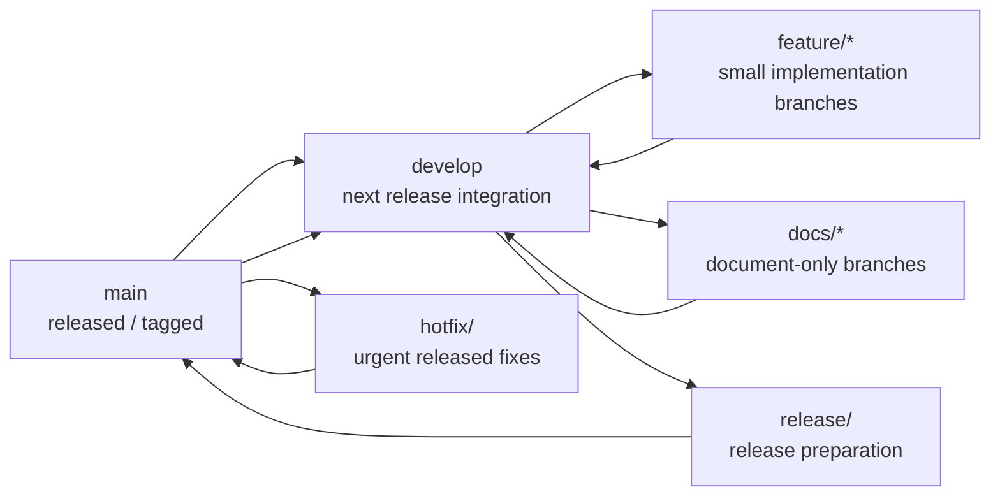

# Astars リリース戦略

ステータス: draft

関連文書:

- [STRATEGY.ja.md](STRATEGY.ja.md)
- [ROADMAP.ja.md](ROADMAP.ja.md)
- [MIGRATION.ja.md](MIGRATION.ja.md)
- [V0_PLAN.ja.md](V0_PLAN.ja.md)

この文書は、Astars の branch strategy、versioning、PyPI / TestPyPI への publish 方針を定義する。

目的は、v0 実装に入る前に、どの branch を安定線とし、どの version を PyPI に登録し、TestPyPI をどう使うかを明確にすることである。

## Current State

2026-05-31 時点の公開 package は次の通り。

- PyPI: [`astars 0.0.1`](https://pypi.org/project/astars/)
- TestPyPI: [`astars 0.0.2`](https://test.pypi.org/project/astars/)

repository の version は `setuptools_scm` により tag から生成する方針になっている。

現状の課題:

- PyPI と TestPyPI の version 履歴が揃っていない
- release 用 tag と publish 手順の関係が明文化されていない

2026-05-31 時点の v0 public API 実装では、次の整理を進めた。

- `feature/engine` は `develop` に統合済み
- v0 実装は `feature/v0-public-api` で進める
- package metadata は `pyproject.toml` に集約する
- `setup.py` / `setup.cfg` は削除する

## Goals

release strategy は次の状態を目指す。

- PyPI には公式 release だけを publish する
- TestPyPI は publish 手順と artifact の検証に使う
- version は tag から決まる
- 同じ version を再利用しない
- `main` は release 済みの安定線にする
- `develop` は次 release の統合線にする
- feature branch は短命にする
- release 作業は `release/<version>` branch で行う

## Branch Model

Astars では、当面は軽量な Git Flow に近い branch model を採用する。



### `main`

`main` は、release 済みの安定 branch とする。

方針:

- 直接作業しない
- PyPI に publish する commit は `main` 上に存在する
- release tag は `main` に打つ
- `main` の HEAD は原則として install 可能な状態にする

### `develop`

`develop` は、次 release に向けた統合 branch とする。

方針:

- feature branch は原則として `develop` から切る
- feature branch は `develop` に戻す
- v0 実装の統合先は `develop` とする
- `develop` は常に完全安定である必要はないが、最低限 import / test が壊れ続けない状態を目指す

### `feature/*`

`feature/*` は、実装単位の短命 branch とする。

例:

- `feature/v0-public-api`
- `feature/v0-python-parse`
- `feature/v0-query-mapping`
- `feature/v0-packaging`

方針:

- `develop` から切る
- scope を小さくする
- 1 branch で複数 phase を抱えない
- merge 後は削除する
- 長寿命の `feature/engine` のような branch は作らない

### `docs/*`

`docs/*` は、文書専用の短命 branch とする。

例:

- `docs/v0-plan`
- `docs/release-strategy`
- `docs/api-strategy`

方針:

- docs だけを変更する
- code change と混ぜない
- merge 後は削除する

### `fix/*`

`fix/*` は、通常の bug fix branch とする。

方針:

- release 前の bug fix は `develop` から切る
- release 済み version の緊急修正は `main` から `hotfix/*` として切る
- fix branch でも scope は小さくする

### `release/<version>`

`release/<version>` は、release candidate を固めるための branch とする。

例:

- `release/0.1.0`
- `release/0.2.0`

方針:

- `develop` から切る
- package metadata、README、CHANGELOG、release note、CI を整える
- 新機能は原則追加しない
- TestPyPI への publish 検証はこの branch または release tag candidate で行う
- release 完了後、`main` と `develop` の両方へ反映する

### `hotfix/<version>`

`hotfix/<version>` は、release 済みの version に対する緊急修正 branch とする。

例:

- `hotfix/0.1.1`

方針:

- `main` から切る
- 修正後、`main` に merge して patch release tag を打つ
- その後 `develop` にも反映する

## Current Branch Cleanup

旧 `feature/engine` は、engine 実装と戦略 docs が集まった長寿命 branch だった。

整理結果と今後の方針:

1. `feature/engine` の内容は `develop` に統合済み
2. `feature/engine` は新規作業の起点にしない
3. v0 実装は `develop` から小さな `feature/v0-*` branch を切る
4. docs 作業は `docs/*` branch に分ける

`feature/engine` は歴史的な移行 branch として扱い、今後の本線にはしない。

## Versioning Policy

Astars は、PEP 440 compatible な version を使う。

基本形:

```text
MAJOR.MINOR.PATCH
```

v0 の間は `0.x.y` を使う。

意味:

- `0.1.0`: v0 public API の初回 release
- `0.1.1`: bug fix / packaging fix
- `0.2.0`: edit primitive などの機能追加
- `0.3.0`: language support 拡張など
- `1.0.0`: public API の安定宣言

## Next Public Version

PyPI には既に `0.0.1` が存在する。TestPyPI には `0.0.2` が存在する。

次の PyPI release は `0.1.0` とする。

理由:

- `0.0.x` は初期実験 version として扱う
- v0 public API を持つ最初の engine release として `0.1.0` が自然である
- TestPyPI の `0.0.2` に合わせて PyPI を `0.0.2` にする必要はない
- TestPyPI の version 履歴は本番 release の判断基準にしない

## Pre-release Policy

release 前の検証が必要な場合は、PEP 440 の pre-release を使う。

例:

```text
0.1.0a1
0.1.0a2
0.1.0rc1
0.1.0
```

方針:

- `a` は実装途中の alpha
- `rc` は release candidate
- PyPI に publish する final release は `0.1.0`
- TestPyPI での検証には `0.1.0a1` や `0.1.0rc1` を使ってよい

ただし、小規模な v0 release では、TestPyPI に `0.1.0rc1` を publish して確認し、問題なければ `v0.1.0` tag から PyPI に publish する運用で十分である。

## Tag Policy

release tag は次の形式にする。

```text
v0.1.0
v0.1.1
v0.2.0
```

方針:

- tag は `main` に打つ
- PyPI publish は tag から行う
- tag と PyPI version は一致させる
- `setuptools_scm` の生成 version と tag の関係を release 前に確認する

## PyPI Policy

PyPI は公式 release の配布先とする。

方針:

- release tag から build した artifact だけを upload する
- 開発途中の artifact は upload しない
- 同じ version を再利用しない
- upload 後に差し替えが必要な場合は patch version を上げる
- `0.1.0` を publish した後の修正は `0.1.1` とする

PyPI に publish する前に確認すること:

- `main` に release commit が merge されている
- release tag が打たれている
- clean checkout で build できる
- install smoke test が通る
- README / package metadata が正しい
- TestPyPI で publish 手順を確認済みである

## TestPyPI Policy

TestPyPI は、publish 手順と artifact の検証に使う。

方針:

- TestPyPI の version 履歴は PyPI 本番 version と同期しなくてよい
- ただし、同じ version を繰り返し使わない
- 実験的な upload に本番予定 version を雑に使わない
- release candidate 用の version を使う

例:

```text
0.1.0rc1  -> TestPyPI
0.1.0     -> PyPI
```

TestPyPI に既に `0.0.2` が存在することは、今後の PyPI version には影響させない。

## Packaging Policy

package metadata は、`pyproject.toml` に集約する。

`setup.py` / `setup.cfg` に metadata を重複して持たせない。v0 では、PEP 517 / PEP 621 ベースの build を前提にする。

方針:

- build backend は `pyproject.toml` を基準にする
- version は `setuptools_scm` によって tag から生成する
- package discovery を明示する
- runtime dependencies を整理する
- supported Python version は package metadata に明示する
- legacy `setup.py` / `setup.cfg` は削除する

v0 runtime dependency:

- `anytree`
- `tree-sitter`
- `tree-sitter-python`

v0 は Python reference path を主対象にするため、`tree-sitter-python` は required dependency として扱う。別言語対応を追加する段階で、language-specific parser package を optional extra に分けるか再検討する。

v0 supported Python version:

- Python 3.10+

## v0 Release Flow

`0.1.0` release は、次の流れを基本とする。

1. `develop` から `feature/v0-public-api` を切る
2. public API skeleton を実装する
3. `develop` に merge する
4. `feature/v0-python-parse` を切る
5. Python parse path を実装する
6. `develop` に merge する
7. `feature/v0-query-mapping` を切る
8. query / traversal / source mapping を実装する
9. `develop` に merge する
10. `feature/v0-packaging` を切る
11. package metadata と tests を整える
12. `develop` に merge する
13. `release/0.1.0` を切る
14. README / examples / release note を整える
15. TestPyPI に `0.1.0rc1` を publish して検証する
16. 問題があれば `release/0.1.0` で修正し、必要なら `0.1.0rc2` を検証する
17. `release/0.1.0` を `main` に merge する
18. `main` に `v0.1.0` tag を打つ
19. `v0.1.0` tag から PyPI に publish する
20. `main` を `develop` に merge back する

## Release Checklist

release 前 checklist:

- [ ] `CHANGELOG.md` または release note を用意する
- [ ] README の install / usage が正しい
- [ ] package metadata が正しい
- [ ] version tag が正しい
- [ ] clean environment で build できる
- [ ] clean environment で install できる
- [ ] `import astars` が通る
- [ ] `astars.parse_str(..., lang="python")` が通る
- [ ] public API tests が通る
- [ ] TestPyPI publish が成功している
- [ ] TestPyPI から install して smoke test が通る
- [ ] PyPI publish 対象の artifact が release tag 由来である

## Clean Install Checklist

release branch 上で、local working tree ではなく build artifact から install できることを確認する。

release tool を用意する。

```bash
python3 -m pip install -e ".[release]"
```

`checkPypi.sh`、`checkInstall.sh`、`registPypi.sh` は、既定では `python3` を使う。別の Python を使う場合は `PYTHON` で明示する。

```bash
PYTHON=/path/to/venv/bin/python ./checkPypi.sh
PYTHON=/path/to/venv/bin/python ./checkInstall.sh dist
PYTHON=/path/to/venv/bin/python ./registPypi.sh testpypi
```

`build` / `twine` が見つからない場合、script は artifact を削除する前に停止し、release dependency の install 手順を表示する。

artifact を作る。

```bash
./checkPypi.sh
```

clean venv に wheel を install して smoke test する。

```bash
./checkInstall.sh dist
```

## TestPyPI Checklist

TestPyPI には release candidate を upload する。TestPyPI では runtime dependency が揃わないことがあるため、install 検証では PyPI 本番を dependency index として併用する。

前提:

- release candidate tag または release branch 由来の artifact を使う
- TestPyPI に既に存在する version は再利用しない
- 本番予定 version を雑に TestPyPI へ上げない

TestPyPI に upload する。

```bash
./checkPypi.sh
./registPypi.sh testpypi
```

release tool 用の venv を使う場合:

```bash
PYTHON=/path/to/venv/bin/python ./checkPypi.sh
PYTHON=/path/to/venv/bin/python ./registPypi.sh testpypi
```

TestPyPI から clean venv に install して smoke test する。

```bash
ASTARS_VERSION=0.1.0rc1 ./checkInstall.sh testpypi
```

本番 PyPI への upload は、TestPyPI install smoke test が通った後に行う。

```bash
./registPypi.sh pypi
```

PyPI publish 後も、同じ smoke test を PyPI から実行する。

```bash
ASTARS_VERSION=0.1.0 ./checkInstall.sh pypi
```

## Do Not Do

避けること:

- `main` で直接実装する
- 長寿命の `feature/engine` を開発本線として使い続ける
- TestPyPI のためだけに本番 version を雑に進める
- PyPI に開発途中の artifact を upload する
- 同じ version を再利用しようとする
- tag なしの commit から PyPI に publish する
- code change と docs-only change を不必要に混ぜる

## Open Decisions

未決定事項:

- `develop` を今後も維持するか、将来的に `main` trunk-based に寄せるか
- release note / changelog のファイル名をどうするか
- GitHub Actions で build / publish を自動化するか
- `0.1.0rc1` を TestPyPI のみに publish するか、PyPI pre-release としても publish するか
