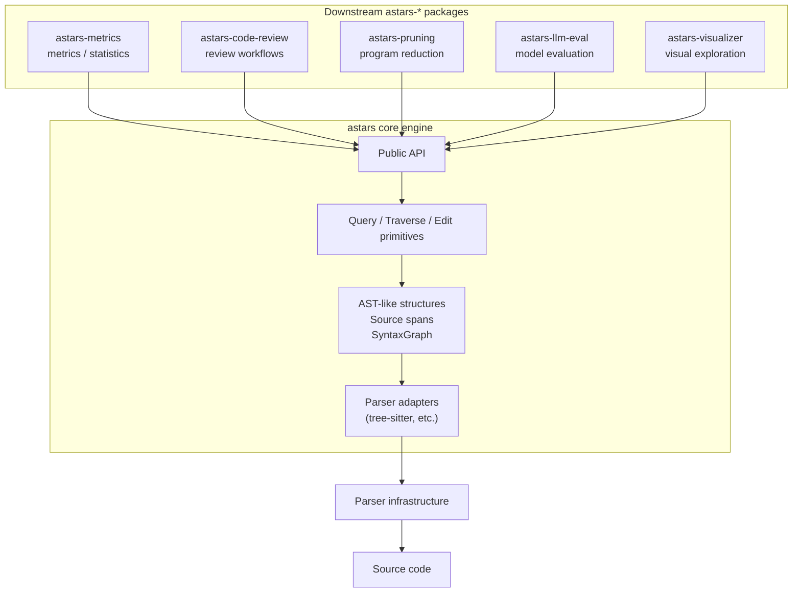

# Astars 戦略

ステータス: 継続更新中

現時点では日本語版を primary document とする。英語版は、戦略文書群が安定してからまとめて同期する。

この文書は、Astars の上位戦略を揃えるための叩き台である。パッケージ構成、クラス名、実装詳細よりも上のレイヤーで、Astars が何を目指し、何を目指さないかを定義する。

詳細なユースケース、実装ロードマップ、ドキュメント構成は次の文書に分ける。

- [USE_CASES.ja.md](USE_CASES.ja.md): research / practical use cases
- [ROADMAP.ja.md](ROADMAP.ja.md): adoption story と近い実装戦略
- [DOCS_PLAN.ja.md](DOCS_PLAN.ja.md): ドキュメント分割計画

## ビジョン

Astars は、プログラム分析のための構造エンジンである。

Astars は、分析結果が何を意味するかを判断しない。また、その結果に基づいて何を行うべきかも判断しない。代わりに、外部の分析モジュールがコードを安定して解析・検索・比較・変形できるように、ソース位置と対応づいたプログラム構造を提供する。

短く言えば、Astars は次のためのエンジンである。

> parser 固有の構文木を、分析に使いやすいプログラム構造へ変換する。

## 想定利用者

Astars は、単体で完結する分析アプリケーションではなく、分析ツールを作る人のための engine である。主な利用者は次の層を想定する。

### Downstream Package Author

`astars-metrics`, `astars-code-review`, `astars-pruning`, `astars-llm-eval` など、Astars を取り込んで分析・応用 package を作る人。

この層にとって重要なのは、parser の詳細に依存せず、安定した parse/query/source-mapping API に依存できることである。

### Software Engineering Researcher

repository mining、program reduction、code model evaluation、変換実験などを行う研究者。

この層にとって重要なのは、実験ごとに parser glue を作り直さず、source span と node の対応を保持したまま構造データを扱えることである。

### Practical Engineering Team

社内の code review 補助、migration、architecture rule check、LLM coding assistant、test impact analysis などを作る開発チーム。

この層にとって重要なのは、組織固有の policy や workflow を downstream 側に置きつつ、共通のコード構造 engine を再利用できることである。

### Language Extension Contributor

新しい言語 adapter や AST rule を追加する contributor。

この層にとって重要なのは、parser 固有の処理を adapter に閉じ込め、Astars の core concept へどう写像するかを明確にできることである。

## エコシステム戦略

Astars は、エコシステム全体の中核エンジンである。

`astars` という名前は、関連プロジェクトをすべて取り込む umbrella package として空けておくのではなく、軽量な中核エンジンの名前として使う。umbrella package を作ると、依存関係、バージョン管理、責務境界の管理が重くなりやすい。

そのため、方針は次の通りとする。

- `astars` は軽量な core engine である。
- `astars-*` は、Astars を使う分析・応用パッケージである。
- downstream package は `astars` に依存する。
- `astars` core は downstream package に依存しない。

推奨する命名は次の通り。

- Repository: `astars-engine`
- PyPI distribution: `astars`
- Python import namespace: `astars`
- Downstream repositories/distributions: `astars-metrics`, `astars-code-review`, `astars-pruning` など

これにより、利用者は中核エンジンを自然に `import astars` でき、同時に `astars-*` という名前で周辺パッケージを展開できる。

## モチベーション

プログラム分析では、よく同じ問題が繰り返し発生する。

- parser の API が言語や実装ごとに異なる。
- 具体構文木には parser 固有の細かな情報が多く含まれる。
- 分析コードでは、木のノードと元ソースコードを行き来する必要がある。
- コード変形では、抽象的な意味だけでなく正確な source span が必要になる。
- 研究プロトタイプでは、parse、traverse、tree mapping の層を何度も作り直しがちである。

Astars は、この共通基盤を提供するために存在する。各分析ツールが parser setup、tree normalization、source span mapping、traversal primitive を毎回自前で持たなくてもよい状態を目指す。

## 既存ツールとの差分

Astars は、ソースコードを parse、分析、変形する初めてのツールではない。したがって、Astars の価値は、既存ツールと何が違うのかを明確にして初めて安定する。

### Parser Infrastructure

例: [tree-sitter](https://tree-sitter.github.io/tree-sitter/)

parser infrastructure は、source code を syntax tree に変換することに優れている。特に tree-sitter は、多数の言語に対して高速で堅牢な incremental concrete syntax tree を提供する。

Astars は parser infrastructure と競合するのではなく、その上に乗る。

違いは次の通り。

- tree-sitter は parsing layer である。
- Astars は parsing の上にある analysis engine layer である。

Astars は parser 固有の API を adapter に閉じ込め、parser output を Astars-owned structure に normalize し、downstream analysis package のために source mapping を保持する。

### 言語固有の AST/CST Framework

例: Python `ast`, [LibCST](https://libcst.readthedocs.io/), [Roslyn](https://learn.microsoft.com/en-us/dotnet/csharp/roslyn-sdk/compiler-api-model), [Clang LibTooling](https://clang.llvm.org/docs/LibTooling.html), [Babel parser/traverse](https://babel.dev/docs/babel-traverse)

これらのツールは、それぞれの言語や platform の中で強い。特定言語に対して深い syntax、semantic、transformation capability を提供することが多い。

Astars はこれらを置き換えようとしない。

違いは次の通り。

- 言語固有 framework は、1 つの言語 ecosystem に最適化されている。
- Astars は、分析モジュール群が共通して使える engine shape に最適化する。

Astars は Python から始めてよい。ただし core engine と language-specific adapter/rule を分離し、downstream analysis package が同じ parse/query/source-mapping workflow を再利用できる状態を目指す。

### Static Analysis Platform / Query Engine

例: [CodeQL](https://codeql.github.com/docs/codeql-overview/about-codeql/), [Semgrep](https://semgrep.dev/docs/semgrep-code/overview), [Joern](https://docs.joern.io/)

これらのツールは、多くの場合、完成された分析 workflow を提供する。query language、security rule、data-flow / taint analysis、reporting、CI integration、vulnerability discovery workflow などを含むことがある。

Astars は security scanner や完成された analysis product として競争しない。

違いは次の通り。

- static analysis platform は、分析の表現方法や finding の意味づけまで提供することが多い。
- Astars は、そのような分析を構築するための structural substrate を提供する。

Joern は code property graph に基づく query analysis platform であり、概念的には Astars に近い部分がある。ただし Astars はより軽量な位置に留まる。graph database を必須にせず、built-in vulnerability query language を持たず、security workflow を標準搭載しない。Astars の中心は、composable な Python package のための source-faithful program structure である。

### Refactoring / Code Transformation Framework

例: [OpenRewrite](https://docs.openrewrite.org/), LibCST codemods

transformation framework は、recipe、codemod、migration rule などを通じて、安全に code を変更することに焦点を置く。

Astars は generic な source-aware edit primitive を提供してよいが、domain-specific な transformation strategy は所有しない。

違いは次の通り。

- refactoring framework は、変形の判断や recipe を提供する。
- Astars は、downstream transformation package が利用できる source mapping と primitive operation を提供する。

たとえば、「選択された node に対応する source span を削除する」は Astars primitive でよい。一方で、「pruning 実験のためにどの statement を削除するか」は `astars-pruning` などの downstream package に属する。

### Source Markup / Exchange Format

例: [srcML](https://www.srcml.org/about.html)

source markup tool は、source code を XML などの exchange format として表現し、その表現を通じて source structure にアクセスできるようにする。

Astars は、それとは異なり、library-first な engine として設計する。小さな Python API、analysis-ready な node interface、明示的な source span mapping を中心に置く。

違いは次の通り。

- source markup tool は、portable な representation format を重視する。
- Astars は、analysis package が組み合わせて使える runtime API を重視する。

### Astars が埋めるべき隙間

Astars の価値は、ユーザーが次を求めるときにある。

- full static analysis platform ではなく lightweight engine が欲しい。
- parser node API に直接依存せず、parser isolation が欲しい。
- abstract syntax だけでなく、元 source に戻れる source-faithful mapping が欲しい。
- downstream analysis package のための reusable primitive が欲しい。
- research prototype と packaged analysis tool の両方を支えられる Python library surface が欲しい。
- core を umbrella package にせず、`astars-*` ecosystem の土台が欲しい。

この隙間を埋めることが、Astars の戦略的な位置づけである。

### Core Differentiator

Astars のオリジナリティは、「syntax tree を通じて code を編集できる唯一のツールである」という点には置かない。既存にも、source code を parse、rewrite、regenerate できるツールは複数存在する。

Astars のオリジナリティは、次の組み合わせにある。

> Astars は、source-faithful で編集可能な program structure を、downstream analysis package のための軽量で analysis-neutral な engine として提供する。

つまり Astars は、source に戻れる構造編集を、完成された refactoring product、scanner、codemod framework、言語固有 toolkit としてではなく、再利用可能な engine primitive として提供する。

重要な違いは次の通り。

- 既存ツールの多くは、parsing、analysis intent、transformation recipe、reporting、CLI workflow、言語固有の仮定をまとめて提供する。
- Astars は、parser-isolated な structure、source mapping、traversal、query、edit primitive を公開し、他の package がそれらを組み合わせられるようにする。

言い換えると、Astars は AST editing、source generation、tree querying のような単一機能だけで独自性を主張しない。価値は、それらの能力を `astars-*` ecosystem のための小さな engine surface としてまとめる点にある。

## Design Bets

Astars は、いくつかの設計上の賭けに基づいて作る。これらは、実装や API に迷ったときの判断基準になる。

### Source Mapping は Core Value である

Astars の価値は、単に tree を作ることではなく、分析対象の node から元 source に戻れることにある。source span、source slice、edit primitive は後付けの補助機能ではなく、core concept として扱う。

### Parser は交換可能であるべき

初期実装では tree-sitter を使うが、Astars の public workflow が tree-sitter object に直接依存しないようにする。parser 固有の API は adapter に閉じ込め、downstream package は Astars-owned structure に依存する。

### AST は Analysis-Friendly、CST は Source-Faithful として役割を分ける

分析しやすい抽象構造と、source に忠実な構文情報は役割が違う。Astars は AST-like structure を分析の主対象にしつつ、source span や raw syntax との mapping を通じて source-faithful な操作を可能にする。

### Core は軽く保つ

`astars` core は、downstream package が安心して依存できる軽量 engine として保つ。metrics、review policy、pruning strategy、visualization、reporting などは core に入れず、`astars-*` package に分離する。

### Public API は小さく保つ

Astars は、広い内部構造をそのまま public API として公開しない。downstream package が依存する surface を小さく保つことで、engine の進化と ecosystem の安定性を両立させる。

### Python を Reference Path にする

最初は Python を reference language として、parse、AST construction、source mapping、query、edit primitive の一連の流れを安定させる。その上で、他言語対応を architecture の検証対象として広げる。

## Trade-offs

Astars は、すべての方向に広げるのではなく、engine としての価値を守るためにいくつかの trade-off を受け入れる。

### Full Semantic Analysis は持たない

型解決、data-flow、taint analysis、symbol resolution などは重要だが、初期 core の責務にはしない。必要であれば downstream package や外部 tool と組み合わせる。

### Formatting Preservation の完全性を最初から約束しない

Astars は source-faithful な mapping と edit primitive を重視するが、初期段階からすべての formatting、comment、空白、括弧の完全な保持を保証するわけではない。lossless transformation をどこまで保証するかは、API と実装が安定してから段階的に定義する。

### 多言語対応より Reference Path の安定を優先する

Astars は language-extensible であるべきだが、最初から広い language coverage を約束しない。Python で engine の形を固め、それから second language で設計を検証する。

### 汎用性より小さな Public API を優先する

内部的には多くの情報を持っていても、public API として安定させる範囲は絞る。必要な情報を全部露出するより、downstream package が長く依存できる小さな contract を優先する。

### Product ではなく Engine に留まる

Astars は CLI scanner、code review product、metrics dashboard、refactoring recipe collection にならない。そうした機能は downstream package として作る。

## 位置づけ

Astars は engine であり、end-user 向けの分析プロダクトではない。

Astars は、他のツールが依存できる構造的な土台を提供する。メトリクス計算、コード smell 検出、レポート生成、pruning、LLM 出力評価、可視化、レビュー支援などは、Astars の上に構築される downstream package の責務である。

想定される downstream package の例:

- `astars-metrics`: complexity、node count、source statistics など
- `astars-pruning`: 研究用途の pruning strategy
- `astars-code-review`: code review 向けの分析 workflow
- `astars-llm-eval`: code model evaluation dataset 向け utility
- `astars-visualizer`: graph や source mapping の可視化

これらは Astars core に組み込むのではなく、Astars を import して使う別パッケージとして設計する。

概念的には、Astars は ecosystem の中心に位置する。

依存方向は `astars` core に向かう。downstream package は engine に依存するが、engine は downstream analysis package には依存しない。

## Core の責務

Astars core は、少数の engine responsibility に集中する。

### Parse

ソースコードを読み、parser 実装を呼び出す。初期実装では tree-sitter を想定する。

parser integration は system boundary に置く。parser 固有の API は、engine の外側に漏らさず adapter 層に閉じ込める。

### Normalize

parser 固有の構造を、Astars が所有する表現へ変換する。

normalization の目的は、すべての言語差を消すことではない。目的は、raw parser node よりも分析しやすい、安定した表現を提供することである。

### Map

次の対応関係を信頼できる形で保持する。

- source bytes/text
- parser-origin nodes
- Astars syntax nodes
- AST nodes
- source spans

source mapping は Astars の中核である。分析結果は、可能な限り元ソースへ戻れるべきである。

### Query And Traverse

ノードを検索・走査・解決するための再利用可能な primitive を提供する。

例:

- AST を安定した順序で traverse する
- kind によって node を検索する
- source offset から node を解決する
- node の source span を収集する
- mapped node から source slice を取り出す

### Primitive Transform

汎用的で source-aware な変形 primitive のみを提供する。

例:

- mapped source span を削除する
- mapped source span を置換する
- node に対応する source を抽出する
- node selection から edit plan を作る

domain-specific な strategy は Astars core の外に置く。たとえば、「pruning 実験のために statement を reverse postorder で削除する」は downstream module の strategy であり、「この node に対応する source span を削除する」は engine primitive である。

## 境界

Astars は、分析結果の解釈を所有しない。

Astars は、ある node が `FunctionDef` であること、source span を持つこと、children を持つことを提供してよい。しかし、その関数が複雑すぎるか、レビューコメントを作るべきか、データセットから削除すべきかは判断しない。

それらの判断は、外部の分析モジュールに属する。

## Core Principles

### Source-Faithful

Astars は、常に元ソースへ戻る経路を保持する。source span と source slice は、単なる debug convenience ではなく first-class concern である。

### Parser-Isolated

parser 固有の API は adapter に閉じ込める。通常の workflow では、engine user が tree-sitter node object に直接依存する必要がない状態を目指す。

### Analysis-Neutral

Astars は構造と primitive を提供するが、domain-specific な判断は行わない。特定の分析目的を core model に埋め込まず、多様な分析目的を支えられるようにする。

### Lightweight Core

Astars は、他の package が安心して依存できる軽量な core であるべきである。重い分析 workflow、可視化、reporting、研究固有の strategy は engine の外に置く。

### Language-Extensible

Astars は、他言語を追加できる設計にする。Python を reference language としつつ、architecture は他言語へ拡張可能な状態を保つ。

### Composable

Astars は library として import しやすいべきである。public API は小さく、安定し、downstream package が使いやすい形にする。

### Minimal But Reliable

Astars は、広く浅い分析機能を増やすよりも、少数の信頼できる primitive を提供することを優先する。

## 初期スコープ

最初の stable version は、Python を reference language として進める。

これは Astars を長期的に Python-only にするという意味ではない。Python を使って、engine design、public API、tests、source mapping model を検証するという意味である。

初期 stable scope:

- Python source を string と file から parse する
- Astars-owned syntax/AST structure を構築する
- source-to-node と node-to-source の mapping を提供する
- AST node を traverse/query する
- source span extraction を提供する
- downstream tool 向けの小さな public API を定義する
- 言語追加の方法を文書化する

## Non-Goals

Astars core は次のものではない。

- full compiler frontend
- complete semantic analyzer
- IDE または LSP implementation
- code quality product
- review automation product
- metrics package
- visualization application
- research-specific pruning framework
- すべての `astars-*` project を install する umbrella package

これらは Astars の上に構築してよいが、core engine の責務には含めない。

## Open Questions

- `SourceUnit` の public method set をどこまで v0 で固定するべきか
- `CST` は public API に含めるべきか、それとも主に AST plus source mapping を使わせるべきか
- `AParser`, `APruner`, `ATraverser` のような legacy API は削除、deprecated、thin wrapper として再導入のどれにすべきか
- 現在の `usecase/` package は、`operations/` や `primitives/` のような engine-oriented な名前に変えるべきか
- AST node kind はどの程度 language-neutral にするべきか
- Python reference language としての最小 stable rule set は何か
- stable ID について、edit や parse をまたいでどこまで保証するべきか
- 既存 repository を `astars-engine` に rename するべきか、新 repository を作って移植するべきか
