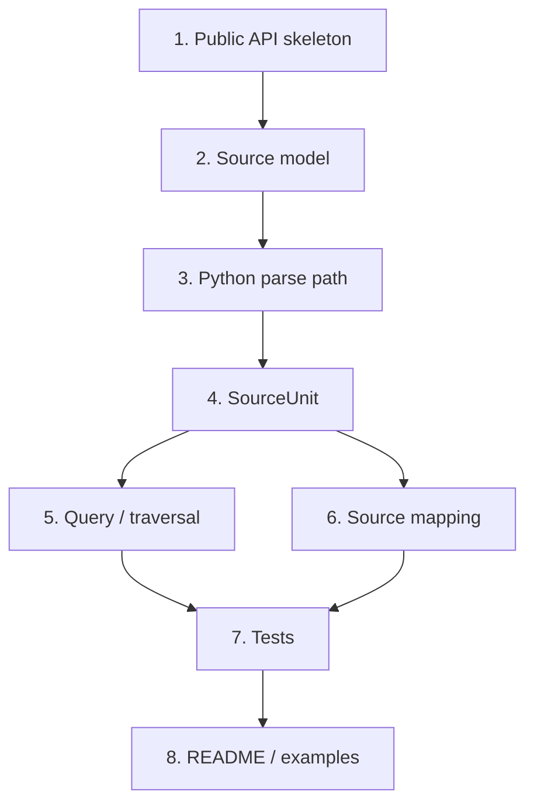

# Astars v0 実装計画

ステータス: draft

関連文書:

- [STRATEGY.ja.md](STRATEGY.ja.md)
- [API_STRATEGY.ja.md](API_STRATEGY.ja.md)
- [CONCEPTS.ja.md](CONCEPTS.ja.md)
- [ARCHITECTURE.ja.md](ARCHITECTURE.ja.md)
- [MIGRATION.ja.md](MIGRATION.ja.md)
- [RELEASE_STRATEGY.ja.md](RELEASE_STRATEGY.ja.md)

この文書は、Astars を軽量な program structure engine として動かすための v0 実装計画である。

`STRATEGY.ja.md` や `ARCHITECTURE.ja.md` は方向性を定義する文書であり、`API_STRATEGY.ja.md` は public API の契約を定義する文書である。この文書は、それらを実際の実装順序に落とす。

## v0 Goal

v0 の目標は、Python source を parse し、AST-like node を query し、node を source span / source text に戻せる最小 engine を作ることである。

最小 workflow:

```python
import astars

unit = astars.parse_str(
    "def hello(name):\n    return f'hello {name}'\n",
    lang="python",
)

functions = unit.find(kind="FunctionDef")
span = unit.span_of(functions[0])
source = unit.source_of(functions[0])
```

この workflow が成立すれば、`astars-metrics`、`astars-code-review`、`astars-llm-eval` などの downstream package が、parser-specific object を直接触らずに prototype を作り始められる。

## v0 Scope

v0 で実装するもの:

- `astars.parse_file`
- `astars.parse_str`
- `astars.parse_bytes`
- `SourceUnit`
- `SourceSpan`
- `Diagnostic`
- public node interface
- `unit.walk(kind=None)`
- `unit.find(kind=None)`
- `unit.node_at(byte_offset)`
- `unit.span_of(node)`
- `unit.source_of(node)`
- Python source の parse path
- AST node から source span への mapping
- minimum tests
- README/example の最小更新

v0 で実装しないもの:

- edit primitive
- stable CST public API
- stable `RawSyntaxNode` public API
- selector DSL
- semantic analysis
- multi-language support
- legacy `AParser` / `APruner` / `ATraverser` の本格 compatibility
- metrics / review / pruning / LLM policy

## Implementation Strategy

v0 では、ディレクトリ構成の大規模 rename から始めない。

理由:

- まず public API の動作を確立したい
- 既存の `core`, `adapter`, `usecase` 周辺に未整理の変更がある
- rename と behavior change を同時に行うと、移行判断が見えにくくなる

初期実装では、既存の module をできるだけ使いながら `astars` 直下の public surface を作る。責務が固まった後に、`ARCHITECTURE.ja.md` の package layout へ段階的に寄せる。



## Work Items

### 1. Public API Skeleton

まず、`import astars` から見える名前を固定する。

対象:

- `astars/__init__.py`
- `astars/api.py`
- `astars/_version.py`

実装する名前:

- `parse_file`
- `parse_str`
- `parse_bytes`
- `SourceUnit`
- `SourceSpan`
- `Diagnostic`
- `AstarsError`
- `UnsupportedLanguageError`
- `ParserUnavailableError`
- `__version__`

方針:

- v0 では `astars/api.py` を使う
- `astars/api/` package 化は後で判断する
- `__init__.py` は public API の再 export に限定する
- internal module の詳細を `__init__.py` に漏らさない

完了条件:

- `python -c "import astars; print(astars.__version__)"` が動く
- public API として公開する名前が `astars` 直下から import できる

### 2. Source Model

source mapping の基準となる model を先に固める。

対象候補:

- `astars/core/text/text.py`
- `astars/core/source/text.py`
- `astars/core/source/span.py`
- `astars/utils/source_pos.py`

実装する概念:

- `SourceText`
- `SourceSpan`
- byte offset
- 0-based point
- source slice

方針:

- byte offset を canonical representation とする
- `SourceSpan.start_point` / `end_point` は 0-based `(line, column)` とする
- column は byte column を基本とする
- Unicode display column は v0 では扱わない

完了条件:

- byte range から source slice を取得できる
- byte offset と point の対応を test できる
- `SourceSpan` が public object として使える

### 3. Diagnostics And Errors

parse / normalization の問題を public API で扱えるようにする。

対象候補:

- `astars/api.py`
- `astars/core/diagnostics/diagnostic.py`

実装する名前:

- `Diagnostic`
- `AstarsError`
- `UnsupportedLanguageError`
- `ParserUnavailableError`

方針:

- unsupported language は exception にする
- parser dependency missing は exception にする
- syntax error など parser が recovery 可能な問題は、可能な範囲で `unit.diagnostics` に載せる
- `Diagnostic.span` は `None` を許容する

完了条件:

- unsupported language の error がわかりやすい
- parser がない場合の error がわかりやすい
- `unit.diagnostics` が list-like に扱える

### 4. Python Parse Path

Python source を parser adapter 経由で parse できるようにする。

対象候補:

- `astars/adapter/parse/base.py`
- `astars/adapter/parse/treesitter.py`
- `astars/core/syntax/raw.py`
- `astars/core/cst/*`
- `astars/core/ast/*`

方針:

- v0 は Python のみを対象にする
- `lang="python"` 以外は `UnsupportedLanguageError` にする
- tree-sitter object を public API に出さない
- parser-specific node は `RawSyntaxNode` 相当へ変換する
- AST-like root node を `SourceUnit.root` として返す

完了条件:

- `astars.parse_str("x = 1\n", lang="python")` が `SourceUnit` を返す
- `unit.root.kind` を取得できる
- user が tree-sitter object を直接触らなくてよい

### 5. SourceUnit

v0 public API の中心となる object を作る。

対象候補:

- `astars/api.py`
- `astars/core/source_unit.py`

実装する property / method:

- `unit.lang`
- `unit.path`
- `unit.source`
- `unit.root`
- `unit.diagnostics`
- `unit.walk(kind=None)`
- `unit.find(kind=None)`
- `unit.node_at(byte_offset)`
- `unit.span_of(node)`
- `unit.source_of(node)`

方針:

- `SourceUnit` は public handle とする
- 内部の builder / adapter / mapping index を直接公開しない
- `unit.find(kind=...)` はまず kind filter のみにする
- `unit.node_at(byte_offset)` は byte offset ベースにする
- `unit.span_of(node)` は `SourceSpan` または `None` を返す

完了条件:

- `unit.find(kind="FunctionDef")` が使える
- `unit.span_of(node)` が使える
- `unit.source_of(node)` が使える
- `unit.node_at(byte_offset)` が使える

### 6. Public Node Interface

downstream package が依存してよい node interface を整える。

対象候補:

- `astars/core/ast/node.py`
- `astars/core/ast/ast.py`
- `astars/core/common/node_id.py`

v0 で必要な属性:

- `node.kind`
- `node.id`
- `node.children`
- `node.role`
- `node.value`

必須:

- `kind`
- `id`
- `children`

任意:

- `role`
- `value`

方針:

- concrete class 名は強く public contract にしない
- `anytree` などの implementation detail を downstream に強制しない
- `node.id` は 1つの `SourceUnit` 内で安定すればよい

完了条件:

- `for node in unit.walk(): print(node.kind)` が動く
- `node.children` で子 node を辿れる
- node から source span に戻れる

### 7. Query And Traversal

最小の traversal / query を public workflow として通す。

対象候補:

- `astars/core/syntax/query.py`
- `astars/usecase/analyse/walk.py`
- `astars/operations/traversal/*`
- `astars/operations/query/*`

方針:

- v0 では `unit.walk()` と `unit.find(kind=...)` を優先する
- standalone `astars.walk(node)` は v0 では必須にしない
- selector DSL は作らない
- domain-specific query は downstream に置く

完了条件:

- `unit.walk()` が root から traversal する
- `unit.walk(kind="FunctionDef")` が kind filter として使える
- `unit.find(kind="FunctionDef")` が list-like result を返す

### 8. Source Mapping

Astars の中核価値である node-to-source mapping を public workflow にする。

対象候補:

- `astars/core/syntax/mapping.py`
- `astars/core/source/*`
- `astars/core/ast/*`

実装する API:

- `unit.span_of(node)`
- `unit.source_of(node)`
- `unit.node_at(byte_offset)`

方針:

- source span が取れない場合は、無効な span を捏造しない
- mapping 不能な node は `None` または diagnostic で表現する
- source slice は `SourceText` を通じて取得する

完了条件:

- function node の source span が取れる
- function node の source text が取れる
- byte offset から node を解決できる
- mapping の失敗を test で検出できる

### 9. Tests

v0 の public behavior を test で固定する。

優先 test:

- `import astars`
- `parse_str` smoke test
- `parse_file` smoke test
- `parse_bytes` smoke test
- `unsupported language` error
- `SourceSpan` byte range
- `SourceSpan` point
- `unit.walk()`
- `unit.find(kind=...)`
- `unit.span_of(node)`
- `unit.source_of(node)`
- `unit.node_at(byte_offset)`
- `unit.diagnostics`

最小 fixtures:

- single assignment
- function definition
- nested function or class
- syntax error source

完了条件:

- clean environment で v0 public workflow の tests が通る
- source mapping が壊れた時に test が落ちる

### 10. README And Examples

public API が動いたら、README と examples を新 API に合わせる。

対象:

- `README.md`
- `examples/`
- `astars/cli/demo.py`

方針:

- README の最初の例は `AParser` ではなく `astars.parse_str` にする
- source mapping の価値がわかる例を入れる
- pruning example は v0 core example から外す
- 古い example を残す場合は legacy / experimental と明示する

完了条件:

- README から v0 workflow がわかる
- example が parser-specific object を使わない
- example が `unit.find` / `unit.span_of` / `unit.source_of` を示す

## Suggested Implementation Order

実装は次の順で進める。

1. public API skeleton を作る
2. `SourceSpan` / `Diagnostic` / error class を定義する
3. `parse_str` だけを最初に通す
4. `SourceUnit.root` と public node interface を通す
5. `unit.walk()` を通す
6. `unit.find(kind=...)` を通す
7. `unit.span_of(node)` と `unit.source_of(node)` を通す
8. `unit.node_at(byte_offset)` を通す
9. `parse_file` / `parse_bytes` を追加する
10. tests を整理する
11. README / examples を更新する

`parse_file` と `parse_bytes` は重要だが、最初の implementation spike では `parse_str` を優先する。`parse_str` が通れば、source model と parser path と `SourceUnit` の基本形を確認できる。

## Acceptance Criteria

v0 は、次を満たしたら一旦完成とみなす。

- `import astars` が clean environment で動く
- `astars.parse_str(source, lang="python")` が `SourceUnit` を返す
- `SourceUnit.root` が AST-like node を返す
- `unit.walk()` で node を列挙できる
- `unit.find(kind="FunctionDef")` で function node を取得できる
- `unit.span_of(node)` が `SourceSpan` を返す
- `unit.source_of(node)` が元 source slice を返す
- `unit.node_at(byte_offset)` が node を返す
- unsupported language で文書化された error が出る
- README の最初の example が新 API になっている
- v0 public workflow の tests が通る

## Non-Success Signals

次の状態になった場合は、実装方針を見直す。

- public API が parser-specific object を返している
- `SourceUnit` が internal object の寄せ集めになっている
- `unit.source_of(node)` が後付け helper 扱いになっている
- query 実装に domain-specific logic が入り始めている
- edit primitive を急いで入れて source mapping が不安定になっている
- README が legacy `AParser` API を主役にし続けている

## Open Decisions For v0

実装前または実装中に決めること:

- `astars/api.py` を v0 で維持するか、早めに `astars/api/` package に分けるか
- `tree-sitter-python` を必須 dependency にするか optional extra にするか
- `SourceText` を public API に含めるか、`SourceUnit.source` の型としてだけ見せるか
- `unit.walk(kind=None)` の戻り値を list にするか iterator にするか
- `unit.find(kind=None)` の戻り値を list にするか query result object にするか
- syntax error をどこまで diagnostics として保持するか
- legacy `AParser` を v0 の範囲で thin wrapper として戻すか

## After v0

v0 の次に検討するもの:

- edit primitive
- CST の public / extension-level の切り分け
- `RawSyntaxNode` と adapter contract の文書化
- `operations/` package への整理
- package layout の rename
- `astars-metrics` など downstream package の prototype
- second language validation
